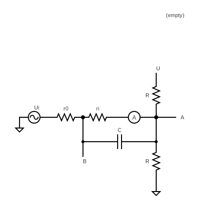
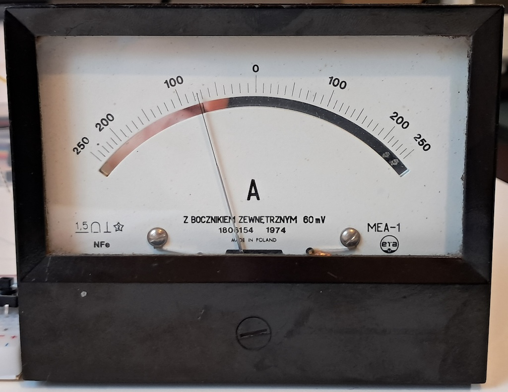
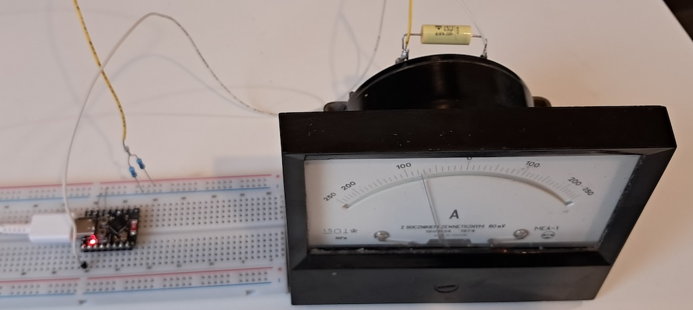

## Antenna circuit

To be added

## Driving the ampere meters

The idea is to drive the ampere meters using pulse width modulation
(PWM) on the **esp32** to display hours, minutes, (seconds).

The esp32 gpio pins have an output voltage of either 3.3V when on and 0V when 
off. But we really need a (semi) continuous range between 0 and 3.3V.

We can achieve this by using PWM set to a resonable frequency and varying
the duty cycle.

One of my ammeters shows positive and negative currents. I need a voltage 
divider circuit that supports this.

Here $R_0$ is the internal resistance of the ESP32 gpio pin(s) and $R_i$ is 
the internal resistance of the ammeter. These are fixed values and need 
to be measured.

Once these are known we need to calculate the value of R to achieve the
desired maximum current.

In my case $R_0$ is 28.7 $\Omega$ and $R_i$ is 14.4 $\Omega$ .

The resistor value for R is 

$R = \frac{U}{I} -2(R_0 + R_i)$

Here U was measured to 3.3V and I was measured to 4.3mA for the maximum amplitude of 
the needle.

So we have

$R = \frac{3.3V}{4.3mA} -2(28.7 + 14.4) = 681 \Omega$. To give a slightly (5%) larger 
range for the needle we choose a slightly smaller value of $620 \Omega$.

Finally we measured the voltage over the two ammeter terminals (A, B) using an 
oscilloscope and discovered that the voltage was too high. This is caused by 
the response of the electronics to the impulse nature of the PWM signal. 

To reduce it we added a capacitor of $0.39 \micro F$.

A final test, after calibrating the 0 and 3.3V output and setting the meter to 33.3 % looks good:

The current test setup:

